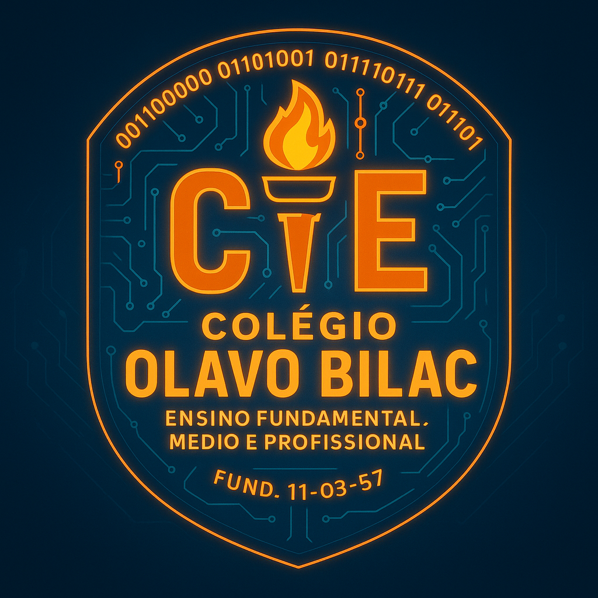

# 🎮 Jogo da Velha – Colégio Olavo Bilac

  

> Projeto desenvolvido pelos alunos do curso **Técnico em Desenvolvimento de Sistemas** do **Colégio Estadual Olavo Bilac**, localizado em Ibiporã - PR.  
> O objetivo é aplicar conceitos de **lógica de programação, estruturas condicionais, funções e IA** em um jogo interativo desenvolvido com **HTML, CSS e JavaScript puro**.

---

## 🕹️ Sobre o projeto

O **Jogo da Velha – Olavo Bilac** é um site interativo onde o usuário joga contra uma **IA (Inteligência Artificial)** em dois níveis de dificuldade:

- 🧠 **Difícil:** usa o algoritmo **Minimax com poda Alpha-Beta**, tornando a IA praticamente invencível.  
- 😄 **Fácil:** realiza jogadas aleatórias e ocasionais bloqueios, ideal para iniciantes.

Quando o jogador vence, é exibido um **banner institucional** convidando-o a conhecer o **Curso Técnico em Desenvolvimento de Sistemas** do Colégio Olavo Bilac, com um botão direto para o **WhatsApp da escola**.

---

## 🚀 Tecnologias utilizadas

| Tecnologia | Descrição |
|-------------|------------|
| 🧩 **HTML5** | Estrutura da aplicação |
| 🎨 **CSS3 (Flex/Grid/Animações)** | Estilização moderna com efeitos neon e glassmorphism |
| ⚙️ **JavaScript (ES6)** | Lógica do jogo, IA e controle de interface |
| 🔥 **Minimax** | Algoritmo de IA utilizado no modo difícil |
| 💬 **WhatsApp API** | Link direto para contato com a escola |

---

## 💡 Funcionalidades

✅ Interface moderna e responsiva (modo vertical e desktop)  
✅ Dois níveis de dificuldade: **Fácil** e **Difícil (padrão)**  
✅ IA inteligente com estratégia de vitória e bloqueio  
✅ Banner institucional com confete e CTA (chamada para ação)  
✅ Link direto para WhatsApp da escola: [`https://wa.me/554332581464`](https://wa.me/554332581464)  
✅ Placar com vitórias, derrotas e empates  
✅ Modo reiniciar e escolha de quem começa  
✅ Código 100% em JavaScript puro (sem frameworks)

---

## 🧩 Estrutura do projeto
📦 jogo-da-velha-olavo-bilac
├── index.html 
├── style.css 
├── script.js 
└── README.md 

## 🏫 Sobre o Colégio

**Colégio Estadual Olavo Bilac – Ensino Fundamental, Médio e Profissional**  
📍 *Ibiporã, Paraná*  
💬 **WhatsApp:** [Clique aqui para conversar](https://wa.me/554332581464?text=Olá!%20Gostaria%20de%20saber%20mais%20sobre%20o%20Curso%20Técnico%20em%20Desenvolvimento%20de%20Sistemas%20do%20Colégio%20Olavo%20Bilac.)  
📅 Fundado em **11/03/1957**

---

## 👨‍💻 Desenvolvido por

Projeto desenvolvido pelos alunos do curso **Técnico em Desenvolvimento de Sistemas**, sob orientação do professor Vinicius Camargo Prattes da área de **Tecnologia e Informática** do **Colégio Estadual Olavo Bilac – Ibiporã/PR**.

---

## 📜 Licença

Este projeto é de uso **educacional e institucional**.  
Distribuição permitida mediante citação da autoria e instituição.  
© 2025 – Colégio Estadual Olavo Bilac

---
